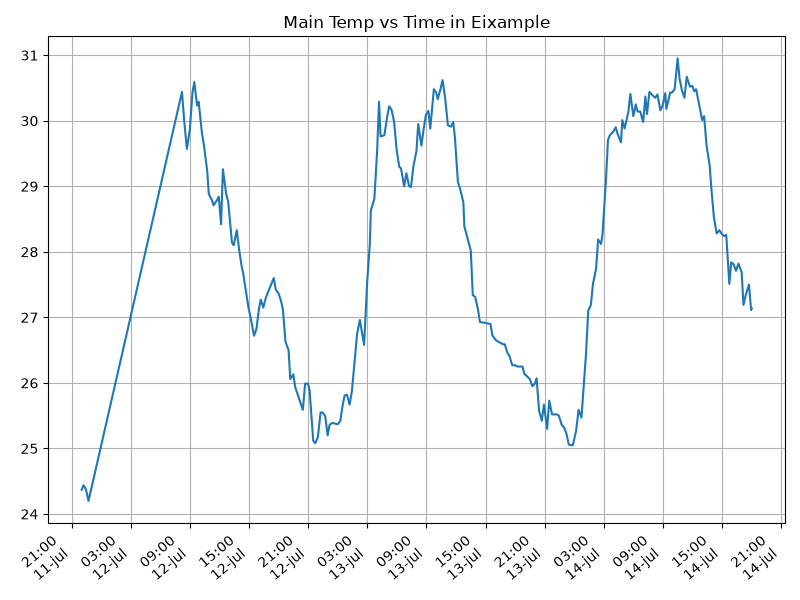
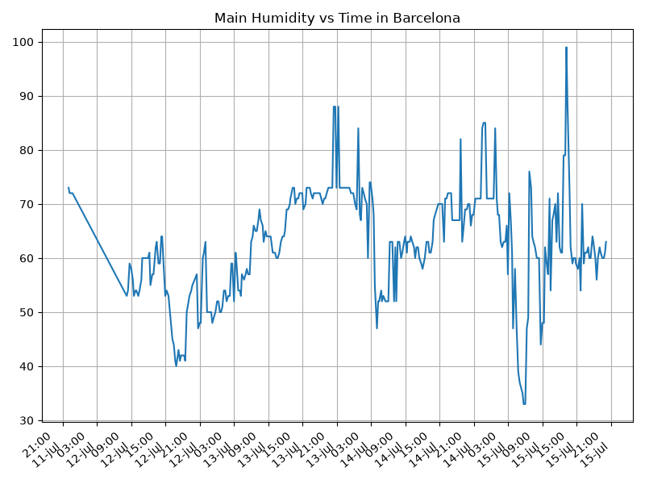
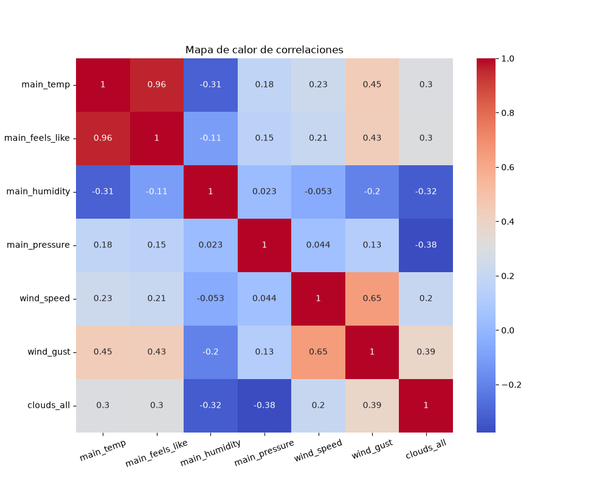

#+options: ':nil *:t -:t ::t <:t H:3 \n:nil ^:t arch:headline
#+options: author:t broken-links:nil c:nil creator:nil
#+options: d:(not "LOGBOOK") date:t e:t email:nil expand-links:t f:t
#+options: inline:t num:t p:nil pri:nil prop:nil stat:t tags:t
#+options: tasks:t tex:t timestamp:t title:t toc:t todo:t |:t
#+PROPERTY: header-args:python :exports both
#+title: Proyecto ICCD332 Arquitectura de Computadores
#+date: 2026-07-11
#+author: Juan Auz, Lanchimba Danny, Palomeque Matías, Quillupangui Ana María
#+email: juan.auzmontezuma@epn.edu.ec
#+language: es
#+select_tags: export
#+exclude_tags: noexport
#+creator: Emacs 27.1 (Org mode 9.7.5)
#+cite_export:
* City Weather APP
Este es el proyecto de fin de semestre en donde se pretende demostrar
las destrezas obtenidas durante el transcurso de la asignatura de
**Arquitectura de Computadores**.

1. Conocimientos de sistema operativo Linux
2. Conocimientos de Emacs/Jupyter
3. Configuración de Entorno para Data Science con Mamba/Anaconda
4. Literate Programming
 
** Estructura del proyecto
Se recomienda que el proyecto se cree en el /home/ del sistema
operativo i.e. /home/<user>/. Allí se creará la carpeta /CityWeather/
#+begin_src shell :results output :exports both
cd
cd BarcelonaWeather 
pwd
#+end_src

#+RESULTS:
: /home/juand/BarcelonaWeather

El proyecto ha de tener los siguientes archivos y
subdirectorios. Adaptar los nombres de los archivos según las ciudades
específicas del grupo.

#+begin_src shell :results output :exports results
cd 
cd BarcelonaWeather
tree --charset=ascii #utilizado para evitar errores de exportacion a pdf
#+end_src

#+RESULTS:
#+begin_example
.
|-- ChatCopilot.md
|-- ChatCopilot.md~
|-- CityTemperatureAnalysis.ipynb
|-- clima-barcelona-hoy.csv
|-- get-weather.sh
|-- get-weather.sh~
|-- main.py
|-- main.py~
|-- output.log
`-- weather-site
    |-- build.sh
    |-- build-site.el
    |-- content
    |   |-- images
    |   |   |-- HeapMap.png
    |   |   |-- Humidity.png
    |   |   `-- Temperatura.png
    |   |-- #index.org#
    |   |-- index.org
    |   |-- index.org~
    |   |-- index.pdf
    |   |-- index.tex
    |   `-- page2-js.org
    `-- public
        |-- images
        |   |-- HeapMap.png
        |   |-- Humidity.png
        |   `-- Temperatura.png
        `-- index.html

6 directories, 24 files
#+end_example

Puede usar Emacs para la creación de la estructura de su proyecto
usando comandos desde el bloque de shell. Recuerde ejecutar el bloque
con ~C-c C-c~. Para insertar un bloque nuevo utilice ~C-c C-,~ o ~M-x
org-insert-structure-template~. Seleccione la opción /s/ para src y
adapte el bloque según su código tenga un comandos de shell, código de
Python o de Java. En este documento ~.org~ dispone de varios ejemplos
funcionales para escribir y presentar el código.

** Formulación del Problema
Se desea realizar un registro climatológico de una ciudad
$\mathcal{C}$. Para esto, escriba un script de Python/Java que permita
obtener datos climatológicos desde el API de [[https://openweathermap.org/current#one][openweathermap]]. El API
hace uso de los valores de latitud $x$ y longitud $y$ de la ciudad
$\mathcal{C}$ para devolver los valores actuales a un tiempo $t$.

Los resultados obtenidos de la consulta al API se escriben en un
archivo /clima-<ciudad>-hoy.csv/. Cada ejecución del script debe
almacenar nuevos datos en el archivo. Utilice *crontab* y sus
conocimientos de Linux y Programación para obtener datos del API de
/openweathermap/ con una periodicidad de 15 minutos mediante la
ejecución de un archivo ejecutable denominado
/get-weather.sh/. Obtenga al menos 50 datos. Verifique los
resultados. Todas las operaciones se realizan en Linux o en el
WSL. Las etapas del problema se subdividen en:

    1. Conformar los grupos de 2 estudiantes y definir la ciudad
       objeto de estudio.
    2.  Crear su API gratuito en [[https://openweathermap.org/current#one][openweathermap]]
    3. Escribir un script en Python/Java que realice la consulta al
       API y escriba los resultados en /clima-<ciudad>-hoy.csv/. El
       archivo ha de contener toda la información que se obtiene del
       API en columnas. Se debe observar que los datos sobre lluvia
       (rain) y nieve (snow) se dan a veces si existe el fenómeno.
    3. Desarrollar un ejecutable /get-weather.sh/ para ejecutar el
       programa Python/Java.[fn:1]
    4. Configurar Crontab para la adquisición de datos. Escriba el
       comando configurado. Respalde la ejecución de crontab en un
       archivo output.log
    5. Realizar la presentación del Trabajo utilizando la generación
       del sitio web por medio de Emacs. Para esto es necesario crear
       la carpeta **weather-site** dentro del proyecto. Puede ajustar el
       /look and feel/ según sus preferencias. El servidor a usar es
       el **simple-httpd** integrado en Emacs que debe ser instalado:
       - Usando comandos Emacs: ~M-x package-install~ presionamos
         enter (i.e. RET) y escribimos el nombre del paquete:
         simple-httpd
       - Configurando el archivo init.el

       #+begin_src elisp
         (use-package simple-httpd
            :ensure t)
       #+end_src

       #+RESULTS:

       Instrucciones de sobre la creación del sitio web se tiene en el
       vídeo de instrucciones y en el archivo [[https://github.com/LeninGF/EPN-Lectures/blob/main/iccd332ArqComp-2024-A/Tutoriales/Org-Website/Org-Website.org][Org-Website.org]] en el
       GitHub del curso

    6. Su código debe estar respaldado en GitHub/BitBucket, la
       dirección será remitida en la contestación de la tarea
** Descripción del código
En esta sección se debe detallar segmentos importantes del código
desarrollado así como la **estrategia de solución** adoptada por el
grupo para resolver el problema. Divida su código en unidades
funcionales para facilitar su presentación y exposición.
*** Librerias a utilizar y variables globales
Durante toda la recepción y transformación de los datos se utilizan
las siguientes librerias: pandas, request, os, pathlib, json. Así también, las variables globales: BarcelonaLat, BarcelonaLon,
API_KEY, fileName 
#+begin_src python :session clima :dir ../../ :results none
import pandas as pd
import requests
import os
import pathlib
import json

BarcelonaLat = 41.38879
BarcelonaLon = 2.15899
API_KEY = "b794b9218f841b4d649bce12eacc5aed"
fileName ='clima-barcelona-hoy.csv' #modificado para coincidir con la ruta
#+end_src
*** Recepción de los datos crudos
Para conseguir los datos de la climatologia de Barcelona se utiliza la
API de openWeather, la cuál requiere los datos de Longitud, Latitud y
una api key, datos que previamente definimos. Se utiliza la libreria
request  para consumir la API y la libreria json para convertir los
datos en un diccionario de python utilizable.
#+begin_src python :session clima :dir ../../ :results none :eval never-export
def getWeather(lat, lon, api):
    URL = f"https://api.openweathermap.org/data/2.5/weather?lat={lat}&lon={lon}&appid={api}&units=metric"
    response = requests.get(URL)
    return response.json()
#+end_src
Con esto, al hacer una llamada al método con las variables
correspondientes a Barcelona conseguimos datos en el siguiente formato
#+begin_src python :session clima :dir ../../ :results output
Barcelona_weather = getWeather(lat=BarcelonaLat, lon=BarcelonaLon, api=API_KEY)
print(json.dumps(Barcelona_weather, indent=2, ensure_ascii=False))
#+end_src

#+RESULTS:
Como se puede observar, la respuesta de la API genera diccionarios anidados. Por ejemplo, el
valor de temperatura mínima se encuentra anidado dentro de ~main~. Uno
de los casos a tener en cuenta es el campo ~weather~ el cuál a
diferencia de main que es un único objeto, es un arreglo. Esto se debe
a que un mismo lugar puede tener varias situaciones climáticas a la
vez, haciendo que el valor especifico de description quede doblemente
anidado. Problema que se solucionará en el procesamiento de los datos
*** Procesamiento de datos
Una vez conseguido los valores en crudo, es necesario aplanarlos y
colocar un formato para un posterior análisis. El método process
recibe el dato crudo proveniente del paso anterior y realiza dos
funciones: Solventar la doble anidación de weather y aplanar el
formato json
#+begin_src python :session clima :dir ../../ :results none
def process(data):
    if "weather" in data and isinstance(data["weather"], list) and data["weather"]:
        data["weather_description"] = data["weather"][0].get("description", None)
        del data["weather"]
    else:
        data["weather_description"] = None
    return pd.json_normalize(data, sep="_")
#+end_src
El proceso consta de un condicional el cuál verifica tres condiciones
en el campo ~weather~: Que exista en el json recibido, que
efectivamente sea una lista y finalmente que tenga al menos un
dato. Una vez verificado la existencia de estos campos procede a
extraer del primer elemento de la lista el valor correspondiente a
description guardandolo como  ~weather_description~ y elimina la clave
original para que no haya repetición. En caso de que el condicional
falle, asigna un valor de ~None~ a este nuevo campo. Finalmente
utilizando pandas, el método devuelve el json aplanado mediante
json_normalize
#+begin_src python :session clima :dir ../../ :results output
jsonProcesado = process(Barcelona_weather)
#Se utiliza transpose (T) para convertir filas en columnas para una mejor visualización
print(jsonProcesado.T.to_string())
#+end_src

#+RESULTS:
*** Almacenamiento en csv
Con nuestros datos aplanados, es necesario guardarlos en un archivo
.csv, tarea que es designada al método ~write2csv~. Sin embargo,
existe una variable que hasta ahora no ha sido contemplada: la API de
OpenWeatherMap genera campos como rain o snow únicamente cuando
ocurren estos fenómenos. Si el archivo inicial fue generado un día despejado,
esas columnas no existirán en la estructura base. Esto se soluciona
mediante la libreria pandas.
#+begin_src python :session clima :dir ../../ :results none
def write2csv(json_processed, csvFile):
    if os.path.isfile(csvFile):
        antiguo = pd.read_csv(csvFile)
        df=pd.concat([antiguo, json_processed], ignore_index=True)
    else:
        df = json_processed
    df.to_csv(csvFile, index=False)
#+end_src
El método consta de un condicional que verifica si el archivo CSV ya
existe en el disco. De ser así, lee el csv antiguo y lo
concatena con los nuevos datos mediante ~pd.concat~. Esta función
alinea las columnas por su nombre, haciendo que si aparece un campo
nuevo como ~rain~ o ~snow~, rellena con valores nulos los campos anteriores. En caso de que el
archivo no exista, no se hacen cambios a los datos recibidos. Finalmente,
los datos se exportan a formato CSV y se guardan en el disco.
#+begin_src python :session clima :dir ../../ :results none
write2csv(jsonProcesado, fileName)
#+end_src
Para ilustrar como se guardan los datos se utiliza la funcion read_csv
#+begin_src python :session clima :dir ../../ :results table 
pd.read_csv(fileName).sample(4).T
#+end_src

#+RESULTS:
|                     |        163 |               63 |              16 |               89 |
|---------------------+------------+------------------+-----------------+------------------|
| base                |   stations |         stations |        stations |         stations |
| visibility          |      10000 |            10000 |           10000 |            10000 |
| dt                  | 1784006813 |       1783915802 |      1783872891 |       1783939361 |
| timezone            |       7200 |             7200 |            7200 |             7200 |
| id                  |    3128760 |          3128760 |         3128760 |          3128760 |
| name                |  Barcelona |        Barcelona |       Barcelona |        Barcelona |
| cod                 |        200 |              200 |             200 |              200 |
| weather_description |  clear sky | scattered clouds | overcast clouds | scattered clouds |
| coord_lon           |      2.159 |            2.159 |           2.159 |            2.159 |
| coord_lat           |    41.3888 |          41.3888 |         41.3888 |          41.3888 |
| main_temp           |      25.59 |            25.36 |           28.78 |            29.99 |
| main_feels_like     |      26.01 |             25.2 |           30.67 |            32.24 |
| main_temp_min       |      24.19 |            23.39 |           26.97 |            28.81 |
| main_temp_max       |      26.85 |            26.29 |           31.46 |            33.02 |
| main_pressure       |       1015 |             1013 |            1015 |             1015 |
| main_humidity       |         69 |               48 |              60 |               57 |
| main_sea_level      |       1015 |             1013 |            1015 |             1015 |
| main_grnd_level     |       1008 |             1006 |            1007 |             1008 |
| wind_speed          |       1.34 |             0.89 |            4.78 |             0.89 |
| wind_deg            |        314 |              317 |              87 |               67 |
| wind_gust           |       3.58 |             4.47 |            6.01 |             6.26 |
| clouds_all          |          5 |               42 |              99 |               39 |
| sys_type            |          2 |                2 |               2 |                2 |
| sys_id              |      18549 |            18549 |           18549 |            18549 |
| sys_country         |         ES |               ES |              ES |               ES |
| sys_sunrise         | 1784003388 |       1783916942 |      1783830497 |       1783916942 |
| sys_sunset          | 1784057051 |       1783970683 |      1783884314 |       1783970683 |
Con eso conseguimos nuestros datos limpios y planos para un posterior análisis
** Script ejecutable sh
Para ejecutar nuestro script, es necesario conocer donde se encuentra
sh y para ello utilizamos el comando ~which~.
#+begin_src shell :results output :exports both
which sh
#+end_src
#+RESULTS:
: /usr/bin/sh
De igual manera se requiere localizar el entorno de mamba *iccd332*
que será utilizado para la ejecución del script

#+begin_src shell :results output :exports both
which mamba
#+end_src
#+RESULTS:
: /home/juand/miniforge3/condabin/mamba
Con esto el archivo ejecutable contiene
#+begin_src shell :results none  :eval never
#!/usr/bin/sh
/home/juand/miniforge3/envs/iccd332/bin/python /home/juand/BarcelonaWeather/main.py
#+end_src
Finalmente se convierte en ejecutable dandole permisos de ejecución
#+begin_src shell :results none :eval never 
#!/usr/bin/sh
chmod +x /home/juand/BarcelonaWeather/get-weather.sh
#+end_src

** Configuración de Crontab
Para crontab, se configura para un intervalo de 15 minutos, con la
ejecución de nuestro script previamente creado. Guarda en el archivo
output.log tanto la salida como los errores generados
#+begin_src shell :results none :eval never
*/15 * * * * cd /home/juand/BarcelonaWeather && ./get-weather.sh >> /home/juand/BarcelonaWeather/output.log 2>&1
#+end_src
* Presentación de resultados
Para la pressentación de resultados se utilizan las librerías de Python:
- matplotlib
- pandas
** Muestra Aleatoria de datos
Presentar una muestra de 10 valores aleatorios de los datos obtenidos.
#+caption: Lectura de archivo csv
#+begin_src python :session :results output exports both
import os
import pandas as pd
from datetime import datetime
# lectura del archivo csv obtenido
dfRaw = pd.read_csv('/home/juand/BarcelonaWeather/clima-barcelona-hoy.csv')
# se convierte de timestamps a tiempos legibles
df = dfRaw.copy()
df.dt = dfRaw.dt.apply(lambda x: datetime.fromtimestamp(x))
df.sys_sunrise = dfRaw.sys_sunrise.apply(lambda x: datetime.fromtimestamp(x))
df.sys_sunset = dfRaw.sys_sunset.apply(lambda x: datetime.fromtimestamp(x))
# se imprime la estructura del dataframe en forma de filas x columnas
print(df.shape)

#+end_src
#+RESULTS:
: (234, 27)

Resultado del número de filas y columnas leídos del archivo csv

#+caption: Despliegue de datos aleatorios
#+begin_src python :session :exports both :results value table :return table
dfToShow = df.copy()
for col in ['dt', 'sys_sunrise', 'sys_sunset']:
    dfToShow[col] = dfToShow[col].astype(str)
table1 = dfToShow.sample(10)
table = [list(table1)]+[None]+table1.values.tolist()
#+end_src

#+RESULTS:
| base     | visibility | dt                  | timezone |      id | name      | cod | weather_description | coord_lon | coord_lat | main_temp | main_feels_like | main_temp_min | main_temp_max | main_pressure | main_humidity | main_sea_level | main_grnd_level | wind_speed | wind_deg | wind_gust | clouds_all | sys_type |  sys_id | sys_country | sys_sunrise         | sys_sunset          |
|----------+------------+---------------------+----------+---------+-----------+-----+---------------------+-----------+-----------+-----------+-----------------+---------------+---------------+---------------+---------------+----------------+-----------------+------------+----------+-----------+------------+----------+---------+-------------+---------------------+---------------------|
| stations |      10000 | 2026-07-12 17:15:02 |     7200 | 3128760 | Barcelona | 200 | broken clouds       |     2.159 |   41.3888 |     27.51 |           27.44 |         25.61 |         28.72 |          1014 |            43 |           1014 |            1007 |       0.45 |      355 |      3.58 |         67 |        2 |   18549 | ES          | 2026-07-12 23:29:02 | 2026-07-13 14:24:43 |
| stations |      10000 | 2026-07-13 00:15:01 |     7200 | 3128760 | Barcelona | 200 | broken clouds       |     2.159 |   41.3888 |     25.42 |           25.38 |         23.68 |          26.5 |          1014 |            52 |           1014 |            1006 |       2.92 |       59 |      3.41 |         51 |        2 |   18549 | ES          | 2026-07-12 23:29:02 | 2026-07-13 14:24:43 |
| stations |      10000 | 2026-07-13 14:25:44 |     7200 | 3128760 | Barcelona | 200 | few clouds          |     2.159 |   41.3888 |     26.93 |            28.9 |         26.42 |          28.5 |          1012 |            72 |           1012 |            1005 |       0.89 |       87 |      1.79 |         16 |        2 |   18549 | ES          | 2026-07-12 23:29:02 | 2026-07-13 14:24:43 |
| stations |      10000 | 2026-07-14 11:25:41 |     7200 | 6544100 | Eixample  | 200 | clear sky           |     2.159 |   41.3888 |     30.67 |           34.16 |         30.18 |         33.13 |          1016 |            60 |           1016 |            1008 |       0.45 |       96 |      4.47 |         10 |        2 |   18549 | ES          | 2026-07-13 23:29:48 | 2026-07-14 14:24:11 |
| stations |      10000 | 2026-07-13 14:55:57 |     7200 | 3128760 | Barcelona | 200 | few clouds          |     2.159 |   41.3888 |     26.92 |           28.88 |         26.42 |         28.44 |          1013 |            72 |           1013 |            1006 |       0.45 |       56 |      2.24 |         11 |        2 |   18549 | ES          | 2026-07-12 23:29:02 | 2026-07-13 14:24:43 |
| stations |      10000 | 2026-07-12 14:14:03 |     7200 | 6544100 | Eixample  | 200 | overcast clouds     |     2.159 |   41.3888 |     27.78 |           29.55 |         25.94 |         28.99 |          1014 |            64 |           1014 |            1007 |       3.74 |       67 |      4.33 |         95 |        2 |   18549 | ES          | 2026-07-11 23:28:17 | 2026-07-12 14:25:14 |
| stations |      10000 | 2026-07-13 19:45:02 |     7200 | 3128760 | Barcelona | 200 | clear sky           |     2.159 |   41.3888 |     25.95 |           25.95 |         25.06 |         26.85 |          1014 |            73 |           1014 |            1007 |       0.76 |      180 |      1.15 |          7 |        2 |   18549 | ES          | 2026-07-13 23:29:48 | 2026-07-14 14:24:11 |
| stations |      10000 | 2026-07-13 16:25:31 |     7200 | 3128760 | Barcelona | 200 | clear sky           |     2.159 |   41.3888 |     26.62 |           26.62 |         25.86 |         27.47 |          1015 |            72 |           1015 |            1006 |       1.52 |      174 |      1.58 |          8 |        2 |   18549 | ES          | 2026-07-12 23:29:02 | 2026-07-13 14:24:43 |
| stations |      10000 | 2026-07-12 16:00:01 |     7200 | 6544100 | Eixample  | 200 | broken clouds       |     2.159 |   41.3888 |     27.14 |           27.36 |         26.36 |         28.08 |          1014 |            47 |           1014 |            1007 |       0.89 |      298 |      3.58 |         77 |        2 |   18549 | ES          | 2026-07-11 23:28:17 | 2026-07-12 14:25:14 |
| stations |      10000 | 2026-07-14 03:13:34 |     7200 | 3128760 | Barcelona | 200 | clear sky           |      2.16 |     41.39 |      29.1 |           33.14 |         28.06 |         30.86 |          1016 |            71 |           1016 |            1009 |       1.79 |      130 |      3.58 |          0 |        2 | 2032131 | ES          | 2026-07-13 23:29:48 | 2026-07-14 14:24:11 |

** Gráfica Temperatura vs Tiempo
Realizar una gráfica de la Temperatura en el tiempo.
#+begin_src python :results file :exports both :session
import matplotlib.pyplot as plt
import matplotlib.dates as mdates
# Define el tamaño de la figura de salida
fig = plt.figure(figsize=(8,6))
plt.plot(df['dt'], df['main_temp']) # dibuja las variables dt y temperatura
# ajuste para presentacion de fechas en la imagen 
plt.gca().xaxis.set_major_locator(mdates.HourLocator(interval=6))
plt.gcf().autofmt_xdate()
plt.gca().xaxis.set_major_formatter(mdates.DateFormatter('%H:%M\n%d-%b'))
# plt.gca().xaxis.set_major_formatter(mdates.DateFormatter('%Y-%m-%d'))  
plt.grid()
# Titulo que obtiene el nombre de la ciudad del DataFrame
plt.title(f'Main Temp vs Time in {next(iter(set(df.name)))}')
plt.xticks(rotation=40) # rotación de las etiquetas 40°
fig.tight_layout()
fname = './images/Temperatura.png'
plt.savefig(fname)
fname
#+end_src

#+caption: Gráfica Humedad vs Temperatura
#+RESULTS:

Debido a que el archivo index.org se abre dentro de la carpeta
/content/, y en cambio el servidor http de emacs se ejecuta desde la
carpeta /public/ es necesario copiar el archivo a la ubicación
equivalente en ~/public/images~

#+begin_src shell
cp -rfv ./images/* ~/BarcelonaWeather/weather-site/public/images
#+end_src

#+RESULTS:
| './images/HeapMap.png'     | -> | '/home/juand/BarcelonaWeather/weather-site/public/images/HeapMap.png'     |
| './images/Humidity.png'    | -> | '/home/juand/BarcelonaWeather/weather-site/public/images/Humidity.png'    |
| './images/Temperatura.png' | -> | '/home/juand/BarcelonaWeather/weather-site/public/images/Temperatura.png' |

**  Realice una gráfica de Humedad con respecto al tiempo
#+begin_src python :results file :exports both :session
fig = plt.figure(figsize=(8,6))
plt.plot(df['dt'], df['main_humidity']) # dibuja las variables dt y temperatura
# ajuste para presentacion de fechas en la imagen 
plt.gca().xaxis.set_major_locator(mdates.HourLocator(interval=6))
plt.gcf().autofmt_xdate()
plt.gca().xaxis.set_major_formatter(mdates.DateFormatter('%H:%M\n%d-%b'))
# plt.gca().xaxis.set_major_formatter(mdates.DateFormatter('%Y-%m-%d'))  
plt.grid()
# Titulo que obtiene el nombre de la ciudad del DataFrame
plt.title(f'Main Humidity vs Time in {next(iter(set(df.name)))}')
plt.xticks(rotation=40) # rotación de las etiquetas 40°
fig.tight_layout()
fname = './images/Humidity.png'
plt.savefig(fname)
fname
#+end_src

#+RESULTS:

**  *Opcional* Presente alguna gráfica de interés.
Se realiza un gráfico de mapa de calor de correlaciones
#+begin_src python :results file :exports both :session
import seaborn as sns
datos = df[['main_temp', 'main_feels_like', 'main_humidity', 'main_pressure',
        'wind_speed', 'wind_gust', 'clouds_all']]
correlaciones = datos.corr()
plt.figure(figsize=(10, 8))
sns.heatmap(correlaciones, annot=True, cmap='coolwarm')
plt.xticks(rotation=20)
plt.title("Mapa de calor de correlaciones")
fname = './images/HeapMap.png'
plt.savefig(fname)
fname
#+end_src

#+RESULTS:

* Instrucciones Java Script
En la siguiente página se indica cómo integrar ~javascript~ como un
alternativa para testear el código.
[[file:index.org][
JavaScript]]

* Referencias
- [[https://emacs.stackexchange.com/questions/28715/get-pandas-data-frame-as-a-table-in-org-babel][presentar dataframe como tabla en emacs org]]
- [[https://orgmode.org/worg/org-contrib/babel/languages/ob-doc-python.html][Python Source Code Blocks in Org Mode]]
- [[https://systemcrafters.net/publishing-websites-with-org-mode/building-the-site/][Systems Crafters Construir tu sitio web con Modo Emacs Org]]
- [[https://www.youtube.com/watch?v=AfkrzFodoNw][Vídeo Youtube Build Your Website with Org Mode]]
* Navegación

[[file:ieee754/pag2-sumaieee754.org][Siguiente: Suma IEEE754 →]]

* Footnotes

[fn:1] Recuerde que su máquina ha de disponer de un entorno de
anaconda/mamba denominado iccd332 en el cual se dispone del interprete
de Python
