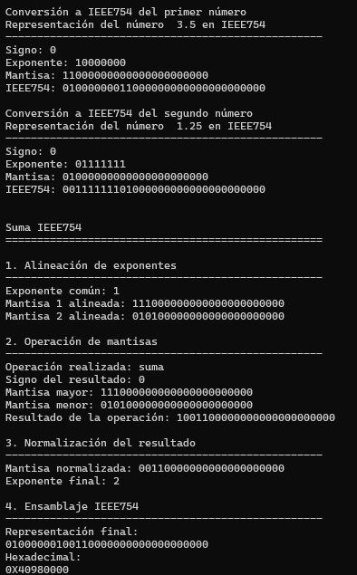
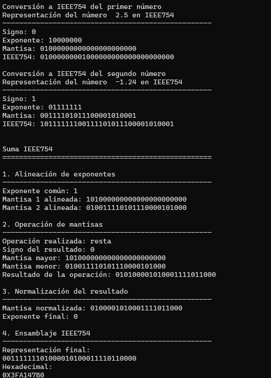
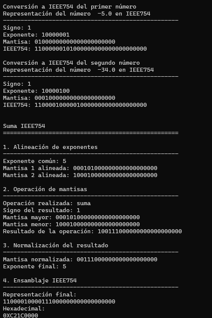
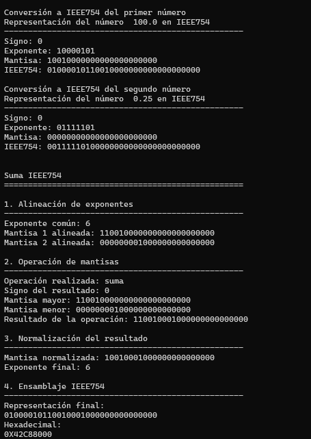
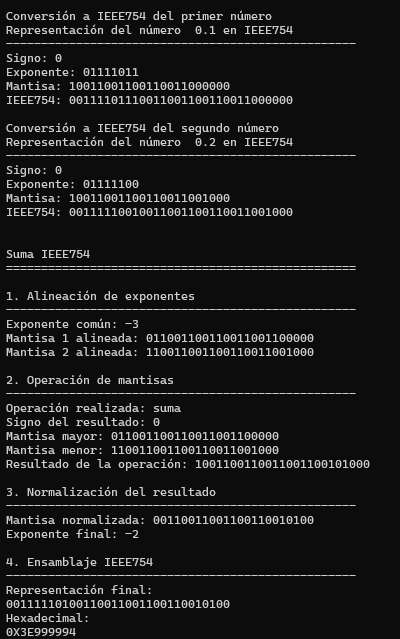

#+options: ':nil *:t -:t ::t <:t H:3 \n:nil ^:t arch:headline
#+options: author:t broken-links:nil c:nil creator:nil
#+options: d:(not "LOGBOOK") date:t e:t email:nil expand-links:t f:t
#+options: inline:t num:t p:nil pri:nil prop:t stat:t tags:t
#+options: tasks:t tex:t timestamp:t title:t toc:t todo:t |:t
#+PROPERTY: header-args:python :session ieee :results output :exports both

#+title: Implementación del Algoritmo de Suma en Notación de Coma Flotante IEEE 754
#+date: 2026-07-13
#+author: Auz Juan, Lanchimba Danny, Palomeque Matías, Quillupangui Ana María
#+email: juan.auzmontezuma@epn.edu.ec
#+language: es

#+select_tags: export
#+exclude_tags: noexport
#+creator: Emacs 27.1 (Org mode 9.7.5)

#+cite_export:

[[file:../index.org][← Inicio]] | [[file:../page3-inec.org][Siguiente: Análisis INEC →]]

* Introducción

El estándar IEEE 754 define la representación y las operaciones
aritméticas para números en punto flotante utilizadas por la mayoría de
los procesadores actuales.

En este trabajo se desarrolla una implementación en Python del algoritmo
de suma de números en formato IEEE 754 de precisión simple (32 bits),
siguiendo las etapas descritas en el estándar y en la literatura de
Arquitectura de Computadores.

El objetivo es comprender el funcionamiento interno de la unidad de
punto flotante, implementando manualmente las diferentes etapas de
la suma binaria.

* Objetivos

- Comprender la representación IEEE 754 de precisión simple.
- Implementar el algoritmo de suma de punto flotante.
- Analizar cada etapa del algoritmo mediante ejemplos.
- Verificar el correcto funcionamiento mediante diferentes pruebas.

* Fundamento teórico

Un número IEEE 754 de precisión simple ocupa 32 bits distribuidos de la
siguiente forma:

| Campo      | Bits |
|------------+------|
| Signo      |    1 |
| Exponente  |    8 |
| Mantisa    |   23 |

El valor representado está dado por

\[
(-1)^S \times 1.M \times 2^{E-127}
\]

donde:

- S representa el bit de signo.
- E es el exponente con sesgo.
- M corresponde a la mantisa.

Antes de realizar una suma en punto flotante se siguen las siguientes
etapas:

1. Comparar exponentes.
2. Alinear mantisas.
3. Realizar la operación.
4. Normalizar el resultado.
5. Reempacar el número en formato IEEE754.

* Descripción del algoritmo

El algoritmo desarrollado se divide en cinco etapas principales.

** Conversión de decimal a IEEE754

Primero se obtiene el signo del número.

#+begin_src python

def obtenerSigno(numero):
    """
    Devuelve el bit de signo según IEEE754
    """
    if numero < 0:
        return 1
    else:
        return 0

#+end_src

Posteriormente el número se separa en parte entera y decimal.

#+begin_src python

def separarPartes(numero):
    """
    Separa un número en su parte entera y decimal
    """
    numero = abs(numero)
    entero = int(numero)
    decimal = numero - entero

    return entero, decimal

#+end_src

La parte entera se convierte a binario.

#+begin_src python

def convertirEnteroBinario(entero):
    """
    Devuelve la parte entera en binario
    """
    return bin(entero).replace("0b","")

#+end_src

La parte fraccionaria se convierte utilizando el algoritmo visto en
clase.

#+begin_src python

def convertirDecimalBinario(decimal):
    """
    Convierte la parte decimal a binario
    """
    bits = ""

    while decimal != 0 and len(bits) < 23:

        decimal *= 2

        if decimal >= 1:
            bits += "1"
            decimal -= 1
        else:
            bits += "0"

    if bits == "":
        return "0"

    return bits

#+end_src

Se unen ambas partes.

#+begin_src python

def convertirBinario(numero):
    """
    Convierte un número decimal a binario
    """
    entero, decimal = separarPartes(numero)
    return convertirEnteroBinario(entero) + "." + convertirDecimalBinario(decimal)

#+end_src

Posteriormente se normaliza el número.

#+begin_src python

def normalizar(binario):
    """
    Normaliza el número binario
    """
    entero, decimal = binario.split(".")

    if entero != "0":
        exponente = len(entero) - 1
        mantisa = entero[1:] + decimal
        return mantisa, exponente

    indice = decimal.index("1")
    exponente = -(indice + 1)
    mantisa = decimal[indice + 1:]

    return mantisa, exponente

#+end_src

El exponente se sesga con 127.

#+begin_src python

def calcularExponente(exponente):
    """
    Calcula el exponente sesgado
    """
    exponente = exponente + 127
    binario = bin(exponente).replace("0b","")
    return binario.zfill(8)

#+end_src

Finalmente la mantisa se ajusta a 23 bits.

#+begin_src python

def ajustarMantisa(mantisa):
    """
    Ajusta la mantisa a 23 bits
    """
    return mantisa.ljust(23,"0")

#+end_src

Con todas las funciones anteriores se implementa la conversión completa.

#+begin_src python

def convertirIEEE754(numero):
    """
    Convierte un número decimal a IEEE754
    """

    if numero == 0:
        return {
            "signo":"0",
            "exponente":"00000000",
            "mantisa":"00000000000000000000000",
            "ieee754":"00000000000000000000000000000000"
        }

    signo = str(obtenerSigno(numero))

    binario = convertirBinario(numero)

    mantisa, exponente = normalizar(binario)

    exponenteIEEE = calcularExponente(exponente)

    mantisaIEEE = ajustarMantisa(mantisa)

    ieee754 = signo + exponenteIEEE + mantisaIEEE

    return {
        "signo":signo,
        "binario":binario,
        "exponenteReal":exponente,
        "exponenteSesgado":exponenteIEEE,
        "mantisa":mantisaIEEE,
        "ieee754":ieee754
    }

#+end_src

** Alineación de exponentes

Para poder sumar dos números IEEE754 ambos deben poseer el mismo
exponente.

#+begin_src python

def alinearExponentes(exp1,mant1,exp2,mant2):

    mant1 = "1" + mant1
    mant2 = "1" + mant2

    while exp1 < exp2:
        mant1 = "0" + mant1[:-1]
        exp1 += 1

    while exp2 < exp1:
        mant2 = "0" + mant2[:-1]
        exp2 += 1

    return exp1, mant1, mant2

print(
    alinearExponentes(
        1,
        "01000000000000000000000",
        0,
        "01000000000000000000000"
    )
)
#+end_src

#+RESULTS:
: (1, '101000000000000000000000', '010100000000000000000000')

** Determinación del tipo de operación

Una vez alineados los exponentes, el algoritmo determina si debe
realizar una suma o una resta dependiendo del signo de ambos
operandos. Cuando los signos son diferentes, también se determina
cuál de las mantisas tiene el mayor valor absoluto para garantizar
que la resta produzca un resultado positivo.

#+begin_src python

def determinarSignoYOrden(signo1, signo2, mant1, mant2):
    """
    Compara los signos para decidir si se suma o se resta.
    Además, ordena las mantisas para que la resta sea siempre positiva,
    y determina cuál será el signo del resultado final.
    """

    val1 = int(mant1, 2)
    val2 = int(mant2, 2)

    if signo1 == signo2:
        return signo1, "suma", mant1, mant2

    else:

        if val1 >= val2:
            return signo1, "resta", mant1, mant2
        else:
            return signo2, "resta", mant2, mant1

print(
    determinarSignoYOrden(
        "0",
        "1",
        "101000000000000000000000",
        "010100000000000000000000"
    )
)

#+end_src

#+RESULTS:
: ('0', 'resta', '101000000000000000000000', '010100000000000000000000')

** Operación entre mantisas

La suma y la resta de las mantisas se implementan utilizando únicamente
operaciones binarias bit a bit, reproduciendo el comportamiento de una
unidad aritmética lógica.

#+begin_src python

def operarMantisas(mantMayor, mantMenor, operacion):
    """
    Suma o resta mantisas binarias utilizando operaciones
    bit a bit.
    Retorna el resultado en binario.
    """
    while len(mantMayor) > len(mantMenor):
        mantMenor = "0" + mantMenor

    while len(mantMenor) > len(mantMayor):
        mantMayor = "0" + mantMayor

    if operacion == "suma":
        resultado = ""
        acarreo = 0

        # Se recorren las cadenas desde el bit menos significativo
        for i in range(len(mantMayor)-1, -1, -1):

            bit1 = int(mantMayor[i])
            bit2 = int(mantMenor[i])

            suma = bit1 + bit2 + acarreo

            if suma == 0:
                resultado = "0" + resultado
                acarreo = 0

            elif suma == 1:
                resultado = "1" + resultado
                acarreo = 0

            elif suma == 2:
                resultado = "0" + resultado
                acarreo = 1

            else:
                resultado = "1" + resultado
                acarreo = 1

        if acarreo == 1:
            resultado = "1" + resultado

        return resultado

    else:
        # Resta binaria
        resultado = ""
        prestamo = 0

        for i in range(len(mantMayor)-1, -1, -1):

            bit1 = int(mantMayor[i]) - prestamo
            bit2 = int(mantMenor[i])

            if bit1 < bit2:
                bit1 += 2
                prestamo = 1
            else:
                prestamo = 0

            diferencia = bit1 - bit2

            resultado = str(diferencia) + resultado

        return resultado
          
print(
    operarMantisas(
        "101000000000000000000000",
        "010100000000000000000000",
        "suma"
    )
)

#+end_src

#+RESULTS:
: 111100000000000000000000

** Normalización del resultado

Después de la operación puede aparecer un acarreo adicional o bien
desaparecer el bit implícito debido a una resta. En ambos casos es
necesario ajustar nuevamente el exponente y la mantisa.

#+begin_src python

def normalizarResultado(mantResultado, expComun):

    if mantResultado == "0":
        return "0", 0

    exponente = expComun

    # Caso suma
    if len(mantResultado) > 24:
        mantResultado = mantResultado[1:]
        exponente += 1

    # Caso resta
    while mantResultado[0] == "0":
        mantResultado = mantResultado[1:] + "0"
        exponente -= 1

    mantisa = mantResultado[1:]

    return mantisa[:23], exponente

print(
    normalizarResultado(
        "111100000000000000000000",
        1
    )
)

#+end_src

#+RESULTS:
: ('11100000000000000000000', 1)

** Ensamblaje final

Una vez obtenidos el signo, el exponente y la mantisa normalizados,
se construye nuevamente la palabra de 32 bits correspondiente al
formato IEEE754.

#+begin_src python
def ensamblarIEEE754(signo, exponenteReal, mantisa):
    """
    Construye el número IEEE754 final.
    """

    if mantisa == "0" and exponenteReal == 0:
        return "00000000000000000000000000000000"

    exponenteIEEE = calcularExponente(exponenteReal)

    mantisaIEEE = ajustarMantisa(mantisa)[:23]

    return signo + exponenteIEEE + mantisaIEEE
#+end_src

** Función principal

La siguiente función integra todas las etapas del algoritmo descritas
anteriormente.

#+begin_src python

def sumarIEEE754(num1, num2):
    """
    Función principal del algoritmo.
    """

    if num1 == 0:
        return {
            "resultadoIEEE754": convertirIEEE754(num2)["ieee754"]
        }

    if num2 == 0:
        return {
            "resultadoIEEE754": convertirIEEE754(num1)["ieee754"]
        }

    ieee1 = convertirIEEE754(num1)
    ieee2 = convertirIEEE754(num2)

    expComun, mant1Alineada, mant2Alineada = alinearExponentes(
        ieee1["exponenteReal"],
        ieee1["mantisa"],
        ieee2["exponenteReal"],
        ieee2["mantisa"]
    )

    signoFinal, operacion, mantMayor, mantMenor = determinarSignoYOrden(
        ieee1["signo"],
        ieee2["signo"],
        mant1Alineada,
        mant2Alineada
    )

    mantResultado = operarMantisas(
        mantMayor,
        mantMenor,
        operacion
    )

    mantNormalizada, expFinal = normalizarResultado(
        mantResultado,
        expComun
    )

    resultado = ensamblarIEEE754(
        signoFinal,
        expFinal,
        mantNormalizada
    )

    return {

        "exponenteComun": expComun,

        "mantisa1Alineada": mant1Alineada,
        "mantisa2Alineada": mant2Alineada,

        "signoFinal": signoFinal,
        "operacion": operacion,

        "mantisaMayor": mantMayor,
        "mantisaMenor": mantMenor,

        "mantisaResultado": mantResultado,

        "mantisaNormalizada": mantNormalizada,
        "exponenteFinal": expFinal,

        "resultadoIEEE754": resultado
    }

#+end_src

* Capturas de ejecución

En esta sección se incluyen las capturas de pantalla obtenidas durante
la ejecución del programa.

- Conversión del primer operando.
- Conversión del segundo operando.
- Alineación de exponentes.
- Determinación de la operación.
- Operación sobre las mantisas.
- Normalización del resultado.
- Ensamblaje del número IEEE754.
- Resultado final.

#+CAPTION: Ejecución del algoritmo para la suma 3.5 + 1.25
#+ATTR_LATEX: :placement [H]

#+CAPTION: Ejecución del algoritmo para la suma 2.5 + (-1.24)
#+ATTR_LATEX: :placement [H]

#+CAPTION: Ejecución del algoritmo para la suma (-5) + (-34)
#+ATTR_LATEX: :placement [H]

#+CAPTION: Ejecución del algoritmo para la suma 100 + 0.25
#+ATTR_LATEX: :placement [H]

#+CAPTION: Ejecución del algoritmo para la suma 0.1 + 0.2
#+ATTR_LATEX: :placement [H]

* Conclusiones

- Se implementó satisfactoriamente el algoritmo de suma de números en
  formato IEEE754 de precisión simple empleando Python.

- El desarrollo permitió comprender el funcionamiento interno de una
  unidad de punto flotante, especialmente el proceso de alineación de
  exponentes, operación entre mantisas y normalización del resultado.

- La implementación reproduce las principales etapas descritas por el
  estándar IEEE754 para la suma en punto flotante.

- Las pruebas realizadas con números positivos, negativos, enteros y
  fraccionarios mostraron resultados consistentes con la representación
  IEEE754 de precisión simple.

- El ejemplo al sumar 0.1 + 0.2 representa los errores que se puede acarrear
  al momento de trabajar con números muy pequeños, al obtener un valor un
  tanto diferente al 0.3 esperado. Esto sucede ya que el algoritmo trunca los
  decimales menos significativos

* Extra: Ejecución interactiva mediante JavaScript

La implementación principal del algoritmo IEEE754 fue desarrollada en Python.
Sin embargo, debido a que los navegadores no pueden ejecutar directamente
código Python, se desarrolló una versión interactiva utilizando JavaScript,
el cual puede ser interpretado directamente por el navegador.

#+begin_export html

<h2>Suma IEEE754 interactiva</h2>

Ingrese dos números para obtener su representación IEEE754.

<input type="number" id="num1" placeholder="Primer número">

<input type="number" id="num2" placeholder="Segundo número">

<button onclick="sumarIEEE()">Sumar</button>

<h3>Resultado:</h3>

#+end_export
* Referencias

- IEEE Computer Society. /IEEE Standard for Floating-Point Arithmetic
  (IEEE Std 754-2019)./ IEEE, 2019.

- Stallings, William. /Computer Organization and Architecture:
  Designing for Performance./ 11th Edition. Pearson.

* Navegación

[[file:../index.org][← Inicio]] | [[file:../page3-inec.org][Siguiente: Análisis INEC →]]
