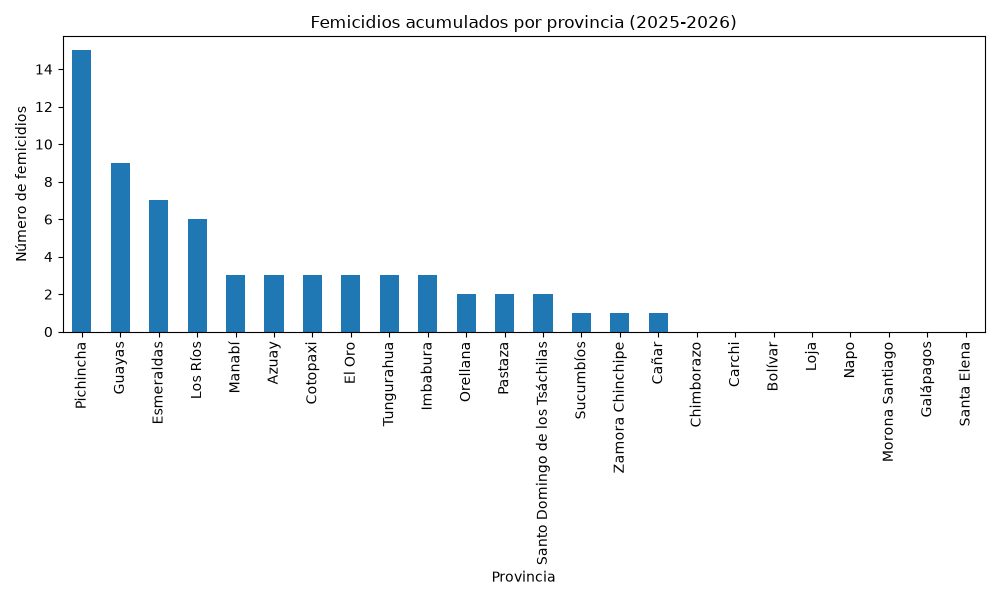
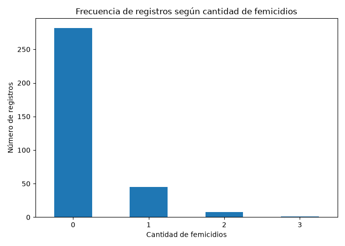

#+options: ':nil *:t -:t ::t <:t H:3 \n:nil ^:t arch:headline
#+options: author:t broken-links:nil c:nil creator:nil
#+options: d:(not "LOGBOOK") date:t e:t email:nil expand-links:t f:t
#+options: inline:t num:t p:nil pri:nil prop:t stat:t tags:t
#+options: tasks:t tex:t timestamp:t title:t toc:t todo:t |:t
#+PROPERTY: header-args:python :exports both

#+title: Análisis de Datos de Seguridad INEC 2025-2026 
#+date: 2026-07-13
#+author: Auz Juan, Lanchimba Danny, Palomeque Matías, Quillupangui Ana María
#+email: juan.auzmontezuma@epn.edu.ec
#+language: es

#+select_tags: export
#+exclude_tags: noexport
#+creator: Emacs 27.1 (Org mode 9.7.5)

#+cite_export:

[[file:index.org][← Inicio]] | [[file:ieee754/pag2-sumaieee754.org][← Suma IEEE754]]

* Análisis de Datos de Seguridad INEC

Este proyecto corresponde al trabajo final de semestre de la asignatura
**Arquitectura de Computadores**.

El objetivo es realizar un análisis de información estadística obtenida
desde los datos proporcionados por el Instituto Nacional de Estadística
y Censos (INEC), aplicando herramientas computacionales para la
extracción, procesamiento, análisis y visualización de datos.

* Formulación del problema

Se desea realizar un análisis estadístico utilizando información
proporcionada por el INEC relacionada con seguridad.

Para esto, se utiliza un conjunto de datos en formato Excel (.xlsx) que contiene
información recopilada durante el año 2025 hasta febrero del 2026.

El objetivo es procesar los datos obtenidos, identificar patrones
relevantes y representar los resultados mediante tablas y gráficos
estadísticos utilizando Python.

* Descripción del código

En esta sección se detallan los componentes principales del código
desarrollado y la estrategia utilizada para resolver el problema.

** Librerías utilizadas y carga inicial de datos

Durante el procesamiento de la información se utilizan las siguientes
librerías:

- pandas
- numpy
- matplotlib
- seaborn

En esta etapa se carga la hoja del archivo Excel que contiene la información
de femicidios por provincia proporcionada por el INEC.

#+begin_src python :session inec :results none

import pandas as pd
import numpy as np
import matplotlib.pyplot as plt

archivo = "../../Datos de Seguridad Ecuador.xlsx"

df = pd.read_excel(
    archivo,
    sheet_name="3.femicidios_prov",
    header=3
)

# Eliminar columna vacía generada por el formato del Excel
df = df.drop(columns=df.columns[0])

#+end_src
* Exploración inicial de los datos

Antes de realizar el análisis se revisa la estructura del conjunto de datos para
identificar sus variables y características principales.
#+begin_src python :session inec :results output

print("Dimensiones del conjunto de datos:")
print(df.shape)   #Imprime las filas y columnas de los datos 

print("\nPrimeras filas del conjunto de datos:")
print(df.head()) #Muestra las primeras filas del DataFrame (por defecto 5)

#+end_src
#+RESULTS:
#+begin_example
Dimensiones del conjunto de datos:
(25, 147)

Primeras filas del conjunto de datos:
  Provincia de ocurrencia  2014-01-01 00:00:00  2014-02-01 00:00:00  2014-03-01 00:00:00  ...  2025-11-01 00:00:00  2025-12-01 00:00:00  2026-01-01 00:00:00  2026-02-01 00:00:00
0                   Azuay                    0                    0                    0  ...                    0                    0                    0                    0
1                 Bolívar                    0                    0                    0  ...                    0                    0                    0                    0
2                   Cañar                    0                    0                    0  ...                    0                    1                    0                    0
3                  Carchi                    0                    0                    0  ...                    0                    0                    0                    0
4                Cotopaxi                    0                    0                    0  ...                    0                    1                    0                    0

[5 rows x 147 columns]
#+end_example

** Selección del periodo de análisis

Debido a que el archivo contiene información desde el año 2014 hasta
2026, se seleccionan únicamente los datos correspondientes al periodo
enero 2025- febrero 2026 para el análisis.

#+begin_src python :session inec :results output

# Seleccionar columnas correspondientes a los años 2025 y 2026
columnas_periodo = [
    columna for columna in df.columns
    if "2025" in str(columna) or "2026" in str(columna) 
]

# Crear nuevo DataFrame con provincias y periodo seleccionado
df_2025_2026 = df[["Provincia de ocurrencia"] + columnas_periodo]
#Mostrar el número de filas y columas del nuevo dataframe
print("Dimensiones del periodo seleccionado:")
print(df_2025_2026.shape)
#Mostrar los nombres de las columnas seleccionadas 
print("\nColumnas seleccionadas:")
print(df_2025_2026.columns)

#+end_src

#+RESULTS:
#+begin_example
Dimensiones del periodo seleccionado:
(25, 15)

Columnas seleccionadas:
Index(['Provincia de ocurrencia',       2025-01-01 00:00:00,
             2025-02-01 00:00:00,       2025-03-01 00:00:00,
             2025-04-01 00:00:00,       2025-05-01 00:00:00,
             2025-06-01 00:00:00,       2025-07-01 00:00:00,
             2025-08-01 00:00:00,       2025-09-01 00:00:00,
             2025-10-01 00:00:00,       2025-11-01 00:00:00,
             2025-12-01 00:00:00,       2026-01-01 00:00:00,
             2026-02-01 00:00:00],
      dtype='object')
#+end_example

* Procesamiento de datos

En esta etapa se realizan las transformaciones necesarias para preparar
la información:

- Selección del periodo de análisis.
- Verificación de valores faltantes.
- Transformación del formato de los datos.
- Preparación de la información para el análisis estadístico.
  
#+begin_src python :session inec :results output

print(df_2025_2026.head()) #Imprime las primeras filas del dataframe

#+end_src
#+RESULTS:
:   Provincia de ocurrencia  2025-01-01 00:00:00  2025-02-01 00:00:00  2025-03-01 00:00:00  ...  2025-11-01 00:00:00  2025-12-01 00:00:00  2026-01-01 00:00:00  2026-02-01 00:00:00
: 0                   Azuay                    0                    1                    0  ...                    0                    0                    0                    0
: 1                 Bolívar                    0                    0                    0  ...                    0                    0                    0                    0
: 2                   Cañar                    0                    0                    0  ...                    0                    1                    0                    0
: 3                  Carchi                    0                    0                    0  ...                    0                    0                    0                    0
: 4                Cotopaxi                    0                    0                    0  ...                    0                    1                    0                    0
: 
: [5 rows x 15 columns]

** Tratamiento de valores faltantes

Se revisa la existencia de valores faltantes dentro del conjunto de datos
seleccionado.

#+begin_src python :session inec :results output

print(df_2025_2026.isnull().sum().sum())  #Cuenta valores nulos o vaciós en el dataframe 

#+end_src

#+RESULTS:
: 0

** Transformación de datos

La información obtenida desde el Excel se encuentra en formato ancho,
donde cada mes corresponde a una columna. Para facilitar el análisis y
la generación de gráficos se transforma a un formato donde cada fila
representa una observación mensual.

#+begin_src python :session inec :results output

# Transformación de formato ancho a formato largo

df_largo = df_2025_2026.melt(  #Transforma formado ando a largo (columnas a filas)
    id_vars=["Provincia de ocurrencia"],
    var_name="Fecha",
    value_name="Femicidios"
)

# Convertir la columna fecha a formato fecha
df_largo["Fecha"] = pd.to_datetime(df_largo["Fecha"]) #Convierte Fecha de texto a formado fecha pandas

print("Dimensiones del nuevo conjunto de datos:")
print(df_largo.shape)

print("\nPrimeras filas:")
print(df_largo.head())

#+end_src

#+RESULTS:
#+begin_example
Dimensiones del nuevo conjunto de datos:
(350, 3)

Primeras filas:
  Provincia de ocurrencia      Fecha  Femicidios
0                   Azuay 2025-01-01           0
1                 Bolívar 2025-01-01           0
2                   Cañar 2025-01-01           0
3                  Carchi 2025-01-01           0
4                Cotopaxi 2025-01-01           0
#+end_example

* Análisis estadístico

El análisis se realiza utilizando el conjunto de datos transformado
(df_largo), donde cada fila representa el número de femicidios registrado
para una provincia en un mes determinado.

** Eliminación de registros agregados

El conjunto de datos contiene un registro correspondiente al Total Nacional,
el cual representa la suma de todas las provincias. Debido a que el análisis
se realizará a nivel provincial, este registro es eliminado para evitar
distorsionar los resultados estadísticos.

#+begin_src python :session inec :results output
#Elimina filas donde la columna de la provincia es 'Total Nacional'
df_largo = df_largo[
    df_largo["Provincia de ocurrencia"] != "Total Nacional" 
]
#Obtiene el numero de provincias únicas que uqedan
print("Número de provincias analizadas:")
print(df_largo["Provincia de ocurrencia"].nunique())

#+end_src

#+RESULTS:
: Número de provincias analizadas:
: 24

** Estadísticas descriptivas

Se calculan medidas estadísticas descriptivas para conocer la distribución
general de los casos registrados.

#+begin_src python :session inec :results table :exports both

estadisticos = (
    df_largo["Femicidios"]
    .describe()  #Genera estadísticas descriptivas automáticamente 
    .reset_index() #Convierte el objeto que toma los valores como índices en una tabla
)

estadisticos.columns = ["Medida", "Valor"] #Cambia nombres de las columnas
#Prepara los datos para mostrarlos como tabla en un Org-mode
table = [list(estadisticos.columns)] + [None] + estadisticos.values.tolist() 

table

#+end_src
#+RESULTS:
| Medida |               Valor |
|--------+---------------------|
| count  |               336.0 |
| mean   | 0.19047619047619047 |
| std    | 0.46938996233925495 |
| min    |                 0.0 |
| 25%    |                 0.0 |
| 50%    |                 0.0 |
| 75%    |                 0.0 |
| max    |                 3.0 |

** Total de femicidios por provincia

Para identificar las provincias con mayor cantidad de casos durante el
periodo analizado se realiza una agrupación por provincia.

#+begin_src python :session inec :results output

femicidios_provincia = (
    df_largo.groupby("Provincia de ocurrencia")["Femicidios"] #Agrupa los datos por provincia 
    .sum() #Suma los valores de cada provincia 
    .sort_values(ascending=False) #Ordena de mayor a menor 
)

print(femicidios_provincia)

#+end_src

#+RESULTS:
#+begin_example
Provincia de ocurrencia
Pichincha                         15
Guayas                             9
Esmeraldas                         7
Los Ríos                           6
Manabí                             3
Azuay                              3
Cotopaxi                           3
El Oro                             3
Tungurahua                         3
Imbabura                           3
Orellana                           2
Pastaza                            2
Santo Domingo de los Tsáchilas     2
Sucumbíos                          1
Zamora Chinchipe                   1
Cañar                              1
Chimborazo                         0
Carchi                             0
Bolívar                            0
Loja                               0
Napo                               0
Morona Santiago                    0
Galápagos                          0
Santa Elena                        0
Name: Femicidios, dtype: int64
#+end_example

** Estadísticos por provincia

A partir del total de femicidios registrados por provincia se calculan
medidas descriptivas para resumir el comportamiento de los datos.

#+begin_src python :session inec :results table :exports both

estadisticos_provincia = (
    femicidios_provincia
    .describe() #Obtiene estadísticas descriptivas
    .reset_index() #Transforma el resultado a un dataframe
)

estadisticos_provincia.columns = ["Medida", "Valor"]
#Crea tabla compatible con ORG
table = [list(estadisticos_provincia)] + [None] + estadisticos_provincia.values.tolist()

table

#+end_src

#+RESULTS:
| Medida |              Valor |
|--------+--------------------|
| count  |               24.0 |
| mean   | 2.6666666666666665 |
| std    |  3.546788708807946 |
| min    |                0.0 |
| 25%    |                0.0 |
| 50%    |                2.0 |
| 75%    |                3.0 |
| max    |               15.0 |

** Evolución mensual de femicidios

Se agrupan los datos por mes para observar el comportamiento temporal
durante el periodo seleccionado.

#+begin_src python :session inec :results output

femicidios_mes = (
    df_largo.groupby("Fecha")["Femicidios"] #Agrupa filas que pertenezcan al mismo mes 
    .sum() #Suma los valores 
) 

print(femicidios_mes)

#+end_src

#+RESULTS:
#+begin_example
Fecha
2025-01-01    5
2025-02-01    5
2025-03-01    6
2025-04-01    5
2025-05-01    6
2025-06-01    5
2025-07-01    2
2025-08-01    7
2025-09-01    3
2025-10-01    5
2025-11-01    4
2025-12-01    4
2026-01-01    4
2026-02-01    3
Name: Femicidios, dtype: int64
#+end_example

** Frecuencia de registros por cantidad de femicidios

Se analiza la frecuencia de los valores registrados para observar la
distribución de los casos.

#+begin_src python :session inec :results output
# Frecuencia de la cantidad de femicidios registrada, cuenta el número de veces que aparece cada valor, ordena utilizando el índice 
print(df_largo["Femicidios"].value_counts().sort_index())

#+end_src

#+RESULTS:
: Femicidios
: 0    282
: 1     45
: 2      8
: 3      1
: Name: count, dtype: int64

** Preparación de datos para visualización

Se generan estructuras resumidas que serán utilizadas posteriormente
para la creación de gráficos estadísticos.

#+begin_src python :session inec :results output

print("Datos preparados:")
print("Provincias analizadas:", len(femicidios_provincia)) #Cuenta el número de provincias analizadas
print("Meses analizados:", len(femicidios_mes)) #Cuenta el número de meses analizados

#+end_src

#+RESULTS:
: Datos preparados:
: Provincias analizadas: 24
: Meses analizados: 14

* Presentación de resultados

En esta sección se presentan los principales resultados obtenidos
a partir del análisis estadístico realizado sobre los datos de
femicidios registrados por provincia durante el periodo 2025-2026.

** Muestra aleatoria de datos

Se presenta una muestra aleatoria de los datos procesados
después de la transformación al formato largo.

#+caption: Muestra aleatoria de datos procesados

#+begin_src python :session inec :results table :exports both
#Selecciona filas aleatorias de df_largo y crea una copia 
tabla_muestra = df_largo.sample(10).copy()
#astype: Convierte la fecha a texto, toma solo los 10 primero caracteres del texto 
tabla_muestra["Fecha"] = tabla_muestra["Fecha"].astype(str).str[:10]

table = [list(tabla_muestra)] + [None] + tabla_muestra.values.tolist()

table

#+end_src

#+RESULTS:
| Provincia de ocurrencia |      Fecha | Femicidios |
|-------------------------+------------+------------|
| Galápagos               | 2026-02-01 |          0 |
| Azuay                   | 2025-10-01 |          0 |
| Carchi                  | 2025-12-01 |          0 |
| Santa Elena             | 2025-09-01 |          0 |
| Manabí                  | 2025-07-01 |          0 |
| Sucumbíos               | 2025-04-01 |          0 |
| Galápagos               | 2025-07-01 |          0 |
| Napo                    | 2025-11-01 |          0 |
| Zamora Chinchipe        | 2025-10-01 |          0 |
| Imbabura                | 2025-02-01 |          0 |

** Provincias con mayor cantidad de femicidios registrados
 

#+caption: Provincias con mayor cantidad de femicidios registrados

#+begin_src python :session inec :results table :exports both

tabla_provincias = (
    femicidios_provincia #Datos ya ordenados previamente 
    .head(10) #Toma las diez primeras provincias
    .reset_index() #Convierte los valores para usarse en tabla normal 
)

table = [list(tabla_provincias)] + [None] + tabla_provincias.values.tolist()

table

#+end_src 

#+RESULTS:
| Provincia de ocurrencia | Femicidios |
|-------------------------+------------|
| Pichincha               |         15 |
| Guayas                  |          9 |
| Esmeraldas              |          7 |
| Los Ríos                |          6 |
| Manabí                  |          3 |
| Azuay                   |          3 |
| Cotopaxi                |          3 |
| El Oro                  |          3 |
| Tungurahua              |          3 |
| Imbabura                |          3 |

** Femicidios acumulados por provincia

La siguiente gráfica permite observar la distribución de los casos
acumulados de femicidio por provincia durante el periodo analizado.

#+begin_src python :session inec :results file graphics :exports both

plt.figure(figsize=(10,6)) #Crea el espacio gráfico 

femicidios_provincia.plot(kind="bar") #Crea el gráfico de barras

plt.title("Femicidios acumulados por provincia (2025-2026)") #Agrega título
plt.xlabel("Provincia") #Etiqueta los ejes
plt.ylabel("Número de femicidios")
#Gira las etiquetas del eje x 90 grados
plt.xticks(rotation=90)
#Ajusta los márgenes del gráfico 
plt.tight_layout()
#Guarda la imagen
archivo="./images/femicidios_provincia.png"

plt.savefig(archivo)

plt.close()

archivo

#+end_src

** Evolución mensual de femicidios

La siguiente gráfica muestra la variación mensual de los casos registrados
durante el periodo seleccionado.

#+begin_src python :session inec :results file graphics :exports both

plt.figure(figsize=(12,5)) #Crea el tamaño de la figura

#Crea el gráfico de líneas 
plt.plot(
    femicidios_mes.index,  #Eje x : Fechas
    femicidios_mes.values, #Eje y : Valores de femicidios por mes 
    marker="o" #Agrega un punto circular en cada dato 
)
 #Títulos y Etiquetas de ejes 
plt.title("Evolución mensual de femicidios (2025-2026)")
plt.xlabel("Mes")
plt.ylabel("Número de femicidios")

# Mostrar todos los meses
plt.xticks(
    femicidios_mes.index, #Indica donde colocar las etiquetas del eje x 
    [fecha.strftime("%b-%Y") for fecha in femicidios_mes.index], #Transforma las fechas al formato Mes-Año
    rotation=45
)
#Agrega cuadrícula 
plt.grid()
#Ajusta los espacios
plt.tight_layout()
#Guarda la imagen 
archivo="./images/evolucion_mensual_femicidios.png"
#Guarda el gráfico como imagen 
plt.savefig(archivo)

plt.close()

archivo

#+end_src
file:images/evolucion_mensual_femicidios.png

** Frecuencia de registros según cantidad de femicidios

La gráfica representa la frecuencia con la que aparecen diferentes
cantidades de femicidios en los registros mensuales por provincia.

#+begin_src python :session inec :results file graphics :exports both
#Calcula la frecuencia de cada valor: cuenta y  ordena
frecuencia = df_largo["Femicidios"].value_counts().sort_index()
#Crea el espacio del gráfico 
plt.figure(figsize=(7,5))
#Crea el gráfico de barras 
frecuencia.plot(kind="bar")
#Etiquetas de la gráfica 
plt.title("Frecuencia de registros según cantidad de femicidios")
plt.xlabel("Cantidad de femicidios")
plt.ylabel("Número de registros")
#Mantiene los valores del eje x horizontales 
plt.xticks(rotation=0)
#Ajusta el diseño 
plt.tight_layout()
#Guarda la imagen 
archivo="./images/frecuencia_femicidios.png"
#Cierra el gráfico
plt.savefig(archivo)

plt.close()

archivo

#+end_src

** Interpretación de los datos
1. **Interpretación de estadísticas descriptivas generales:**
   El análisis descriptivo realizado sobre los registros mensuales pro
   provincia muestra que durante el periodo 2025-2026 se analizaron
   336 observaciones, correspondientes a 24 provincias y 14 meses. El
   promedio obtenido fue de 0.19 femicidios por provincia-mes, esto
   indica que la ocurrencia de estos eventos dentro de una unidad
   específica de análisis es baja.
   La desviación estándar de 0.47 evidencia una dispersión reducida de
   los datos alrededor del promedio. Además, los valores
   correspondientes al primer, segundo y tercer cuartil son iguales a
   cero, indicando que al menos el 75% de los registros mensuales por
   provincia no demuestran casos registrados.
   El valor máximo observado fue de 3 femicidios en una provincia
   durante un mes determinado, mostrando que, aunque la mayoría de
   registros presentan valores bajos, existen periodos específicos con
   concentraciones en mayores casos. 
2. **Interpretación por provincia:**
   Al analizar la distribución acumulada por provincia se observa que
   los registros no se distribuyen uniformemente en el territorio
   nacional. Pichincha concentra la mayor cantidad de casos con 15
   registros, seguida de Guayas con 9 casos y Esmeraldas con 7.
   La diferencia entre el valor máximo y el valor mínimo evidencia una
   variabilidad importante entre provincias. Algunas provincias no
   registraron casos durante el periodo analizado, mientras que otras
   presentan una mayor concentración de eventos.
   Los estadísticos calculados por provincia muestran una media de
   2.67 casos y una mediana de 2 casos, lo que indica que la mitad de
   las provincias presentan valores iguales o inferiores a dos
   registros durante periodo. 
3. **Interpretación Temporal:**
   El análisis temporal permite observar la evolución mensual de los
   femicidios registrados. Durante el periodo estudiado los valores
   mensuales presentan fluctuaciones moderadas, sin una tendencia
   creciente o decreciente claramente definida.
   El mayor número de casos se registró en agosto de 2025 con 7
   femicidios, mientras que julio presentó el menor valor con 2
   casos. Estas variaciones muestran que la ocurrencia de estos
   eventos presenta cambios entre meses, pero debido al tamaño del
   periodo analizado no es posible establecer una tendencia histórica.
4. **Interpretación de la frecuencia:**
   La distribución de la frecuencia evidencia que la mayoría de
   observaciones corresponden a meses y provincias sin registros de
   femicidio. De las 336 observaciones analizadas, 282 presentan un
   valor de cero, mientras que únicamente 54 registros presentan uno o
   más casos.
   Este comportamiento explica por qué las medidas descriptivas
   presentan valores bajos y demuestra que los femicidios corresponden
   a eventos de baja frecuencia cuando se analizan individualmente por
   provincia y mes
5. **Conclusión General**
   En conjunto, el análisis estadístico permitió identificar varios
   factores relevantes en los registros de femicidios del Ecuador
   durante el periodo 2025-2026. Los resultados muestran una
   concentración de casos en determinadas provincias, principalmente
   Pichincha y Guayas, mientras que gran parte de las provincias
   presentan valores reducidos o nulos.
   El análisis descriptivo evidencia que la mayoría de registros
   mensuales no presentan casos, por lo que las medidas como la media
   y los cuartiles reflejan una distribución con alta presencia de
   valores cero. Sin embargo, los valores máximos observados muestran
   la existencia de periodos específicos con mayor concentración de
   casos.
   
* Referencias

- [[https://orgmode.org/][Org Mode Documentation]]
- [[https://pandas.pydata.org/docs/][Pandas Documentation]]
- [[https://matplotlib.org/stable/][Matplotlib Documentation]]
- [[https://www.ecuadorencifras.gob.ec/][Instituto Nacional de Estadística y Censos (INEC)]]

* Navegación

[[file:index.org][← Inicio]] | [[file:ieee754/pag2-sumaieee754.org][← Suma IEEE754]]
